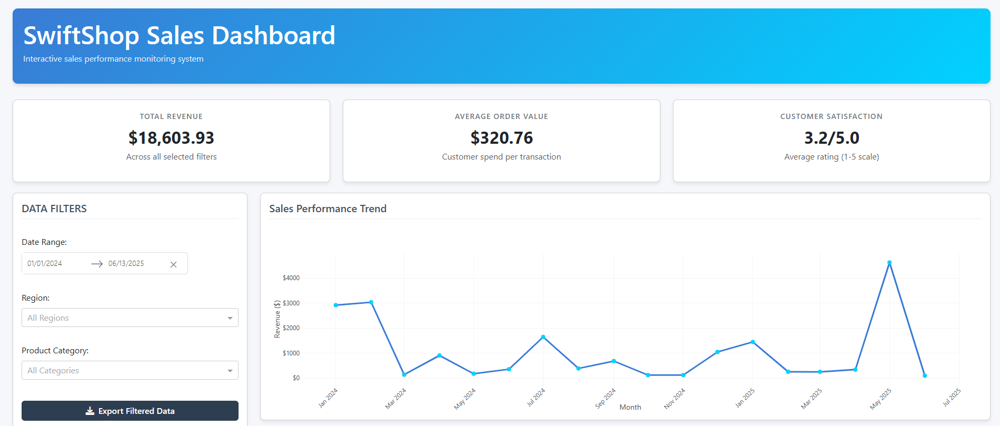

# SwiftShop Sales Dashboard



## Overview
This interactive dashboard provides sales analytics for SwiftShop, an e-commerce platform specializing in three main product categories: Electronics, Clothing, and Home Goods. The dashboard visualizes key performance metrics, sales trends, and customer ratings over an 18-month period.

**Note:** This project was developed using a small sample dataset of approximately 63 rows for demonstration purposes. In a production environment, you would typically use a larger dataset (5,000-10,000 rows as suggested in the requirements).

## Features

### Data Analysis
- Sales performance tracking by time period (daily/monthly)
- Revenue analysis by product category and region
- Customer rating distribution (1-5 scale)
- Key performance indicators (KPIs):
  - Total revenue
  - Average order value
  - Customer satisfaction rating

### Interactive Visualizations
1. **Sales Over Time**: Line chart showing revenue trends
2. **Category Performance**: Pie/bar chart showing revenue distribution by category
3. **Rating Distribution**: Bar chart showing customer satisfaction ratings

### Filters
- Date range picker (custom time periods)
- Region dropdown (North, East, South, West)
- Product category dropdown (Electronics, Clothing, Home Goods)

### Additional Features
- Data export functionality (CSV)
- Responsive design with modern UI
- Interactive data table preview

## Technologies Used
- Python 3.x
- Pandas (data processing)
- Plotly (visualizations)
- Dash (interactive web framework)
- Dash Bootstrap Components (UI styling)

## Installation

1. Clone the repository:
   ```bash
   git clone [repository-url]
   cd [repository-name]
   ```

2. Install dependencies:
    ```bash
    pip install -r requirements.txt
    ```
3. Run the application:
    ```bash
    python app.py
    ```
4. Access the dashboard at: http://127.0.0.1:8050/

## File Structure
```bash
swift-shop-analytics/
├── app.py                # Main application code
├── swiftshop_sales_data.csv  # Sample dataset (63 rows)
├── requirements.txt      # Python dependencies
├── README.md             # This documentation
└── image.png             # Dashboard screenshot
```
## Dataset Information

The sample dataset (swiftshop_sales_data.csv) contains approximately 63 rows with the following columns:

- order_id: Unique order identifier

- order_date: Date of order (YYYY-MM-DD format)

- customer_id: Unique customer identifier

- customer_region: Geographic region (North, East, South, West)

- product_id: Product identifier

- product_name: Product display name

- category: Product category (Electronics, Clothing, Home Goods)

- unit_price: Single item price

- quantity: Number of items ordered

- total_amount: Order total (unit_price × quantity)

- payment_method: Payment type

- customer_rating: Satisfaction rating (1-5)

## Customization

To use with your own dataset:

1. Replace swiftshop_sales_data.csv with your data file

2. Ensure your CSV follows the same column structure

3. Adjust date parsing in app.py if using different date formats

## Limitations

- The current implementation uses a small dataset (63 rows) for demonstration

- Some visualizations may appear sparse with limited data points

- For production use, consider implementing:

    - Database integration

    - User authentication


Developed by: Faisal Alkhunain

Date: 4/23/2025